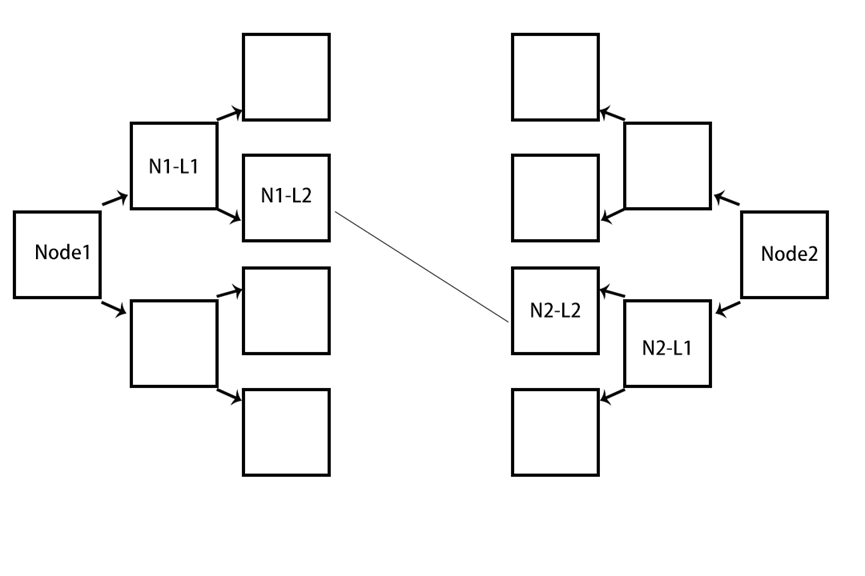
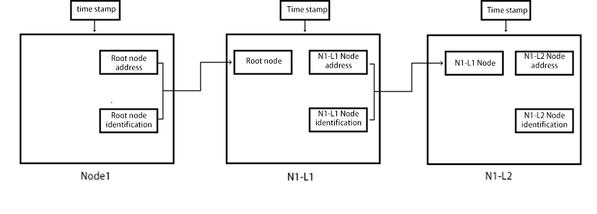
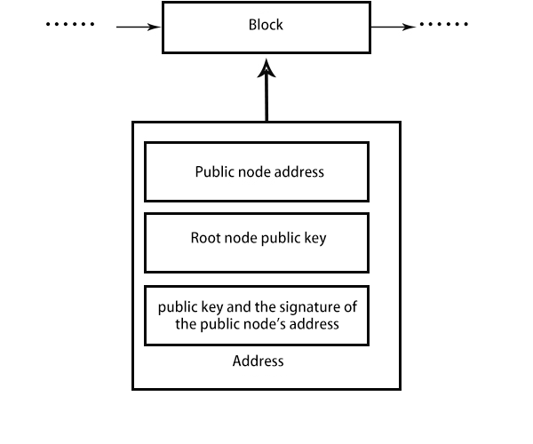
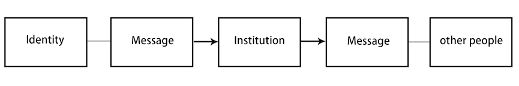
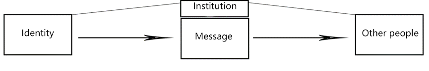

# AnoleNet: A Peer-to-Peer Anonymous Communication System

## AnoleNet: A peer-to-peer anonymous communication system

_author: btaskel bt_asker@hotmail.com_

Abstract:

An anonymous communication system should not rely on any central entity nor use direct addresses for communication. Instead, both parties should remain unaware of each other's existence while maintaining normal interaction. This approach ensures that neither party can be monitored or identified, preserving a state of mutual distrust and security. While a P2P public-private key communication system can provide security, if the communication between the parties is exposed, it can be exploited by malicious actors. On the other hand, communication based on centralized servers requires unconditional trust in the server, which is unacceptable for this system.

In this system, the address of one communicating party is passed through multiple intermediary nodes in a chain, with the data of these intermediary nodes being stored persistently across all network nodes via blockchain technology[1]. This allows any node on the network to communicate with the intended host using its identifier. Additionally, blockchain and its incentive mechanisms ensure the continued operation of the intermediary node chain even if some nodes leave the network.

Keywords: node chain, node scattering, node depth

### 1.Introduction

Today's internet communication almost invariably relies on an intermediary third party or a third-party bridge for P2P communication. This inherent trust model creates a significant issue: both parties' addresses can be exposed. If a third party is relaying messages, a data breach of their database could reveal the entire communication chain. The situation worsens if encryption isn't used or if symmetric keys required for data exchange are stored insecurely. In an untrusted scenario, a third-party intermediary could intentionally monitor, interrupt, or intercept important communication messages. To date, P2P communication can address these issues directly.

However, pure P2P communication still requires an intermediary to relay both parties' addresses. This can be securely managed through the current public-private key system. Yet, if one party uses a proxy for communication, the honest party may be deceived, and the proxy-using party risks having their true identity exposed by an untrusted proxy. Even with multiple proxies for disguise, the other party cannot verify the host's identity and may be deceived or even subjected to retaliatory attacks.

Therefore, there is a need for a system that allows communication without either party knowing the other's true identity and without relying on any trusted third-party intermediary. Communication will be relayed through multiple nodes, with each node scattering the data to increase tracking difficulty. This ensures the communication is not managed by any institution and cannot be traced by either party, not even through traffic monitoring.

In this paper, I propose a solution based on blockchain technology that uses the depth and breadth of node communication to prevent tracing the communication parties. If one party attempts a retaliatory attack upon receiving a message from the other party, such an attack would be futile because tracing either party without the host chain is impossible within this system. As long as the network's nodes are predominantly controlled by honest participants, the system remains secure.

### 2. Breadth and Depth

I refer to each host that joins the network as a node. Upon joining, a node acquires both rights and obligations. The rights include the ability to initiate and receive anonymous communications with any node in the network through node chains. The obligations entail becoming part of the host chain for every communicating node in the network, contributing to both the depth and breadth of communications.

Depth refers to the requirement that communication with a single node must be dispersed to two or more nodes. Breadth refers to the number of intermediary nodes needed for the root node to communicate with an exposed node at the outermost layer (in this paper, we use an example where both depth and breadth are set to 2). Nodes fulfilling their obligations will receive a certain amount of rewards, ensuring the network operates smoothly.

### 3. Node Communication

There remains a challenge regarding how to conceal the address of upstream nodes and how downstream nodes should communicate with them. Here, I propose a communication method through layered node proxies and scattering, called AnoleNet. The first step is to establish anonymous connections with downstream nodes.

In conventional communication, a host needs the address of the destination host to establish communication. In this network, the root node (Node1) passes its random identifier and actual address to its downstream node (N1-L1). The downstream node saves this information and uses the root node's identifier and node address to create a mapping with a random identifier for the root node. Simultaneously, it passes its own address and the secondary identifier generated by the root node to the next node. Given the depth chosen for this example is 2, the downstream node (N1-L2) is the final node exposed to the outside world.
Once the information reaches the exposed node, it notifies the root node that the exposed node has been successfully initialized. The root node then assigns a public key to the exposed node as evidence of joining the node chain. For other nodes, the root node uses modern public-private key exchange techniques to conceal this evidence. The evidence travels through the node chain to reach the exposed node. The exposed node broadcasts the public key, its own address, and the signature of the public key and the exposed node's address. At this point, if a new root node wishes to establish a host connection with this node chain, it only needs to use the public key hash sent by the node chain to find a specific node chain held by the exposed node.

Each node can establish multiple node chains, and these host chains have timestamps within their constituent nodes, representing the lifespan of each chain.

### 4. Scattering

This network can obscure the connection characteristics of node chains, preventing trackers from tracing the data sender or receiver. I propose a link scattering mechanism, where the scattering range is the breadth mentioned in this paper. Suppose a root node wants to establish a node chain to connect to a target node. It will start from the root node and connect to a specified number of secondary nodes according to the scattering breadth. These secondary nodes will determine whether to continue scattering based on the depth. When scattering reaches the exposed node, this exposed node, even if not actually participating in the actual node chain, will randomly link to any node in the network and engage in fake communication with that node. The traffic characteristics must remain consistent with the vast majority of normal network traffic to avoid deep packet inspection (DPI)[2]. This communication has no real value and is only meant to confuse trackers, making it difficult to trace both parties.

### 5. Incentives

To prevent the greed or uncontrolled expansion of blocks by an untrusted node in this network, a blockchain-based "AnoleCoin" reward mechanism will be implemented. Unlike other decentralized currencies that limit the total issuance, AnoleCoin will gradually increase over time. According to Moore's Law proposed by Gordon Moore and the conclusions of David House, computer transistors double every 18 months. Limiting the total issuance contradicts this principle. Therefore, AnoleCoin should stipulate incremental issuance periods that should not exceed the global average bandwidth growth rate or violate Moore's Law.

For a node to establish a node chain and await connections from other nodes, it must pay a predetermined proportion of AnoleCoin to secondary nodes over time. This prevents dishonesty from root or secondary nodes. Secondary nodes will deduct a portion as their reward and distribute the remaining AnoleCoin to other nodes as a fee for relaying data. This fee is also paid proportionally over time. Even if these nodes do not undertake actual communication work, they are still eligible to receive compensation.

### 6. Block Information

After a node establishes a node chain, it will publish the address of the exposed node, the public key, the signature of the exposed node's address, and the root node's public key in a block. When another node attempts to establish a node chain link, it will use the target root node's public key to verify the signature. If the signature verification is successful, the node will attempt to connect to the exposed node. If successful, it will use the public key hash to find the corresponding node chain.

When another node chain tries to locate a specific node chain's root node public key, it will start by searching its latest blocks and work its way down until it finds the matching exposed node information.

### 7. Resource Recycling
   
When a node in an active node chain wants to exit the chain, it must first send a chain exit notification to the root node. Then, it should broadcast this exit behavior to all nodes in the chain to the best of its ability. Afterward, it can exit at a random time. If the root node wishes to continue communication after the exit, it will need to find idle nodes in the network and use them to create or complete a new chain.

If the exposed node fails to broadcast successfully or if the root node cannot determine whether a node's exit is related to its own chain, it will create chaotic, invalid information lingering in the network. If this information remains in the blocks for an extended period, it should be removed.

### 8. Privacy

In traditional institution-managed information exchange, in the worst-case scenario, the institution can obtain information about both parties.

In traditional institution-mediated P2P information exchange, in the worst-case scenario, the institution can obtain the identities of both parties.

In AnoleNet-based P2P information exchange, even in the worst-case scenario, an institution can only capture sensitive traffic within the communication network but cannot easily trace the identities of both parties.

![img_5.png](img_5.png

### References:

[1] Bitcoin: A Peer-to-Peer Electronic Cash System

[2] Fingerprinting Obfuscated Proxy Traffic with Encapsulated TLS Handshakes