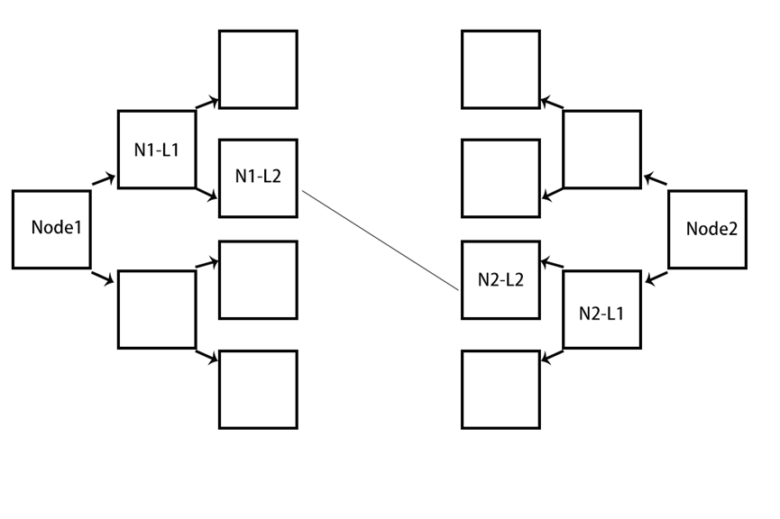
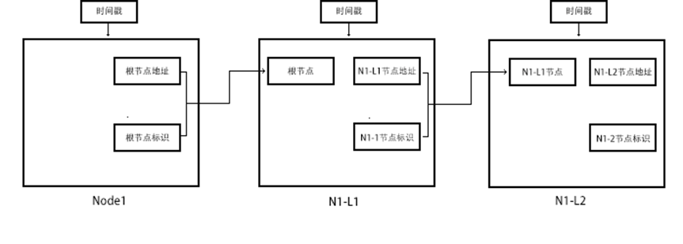
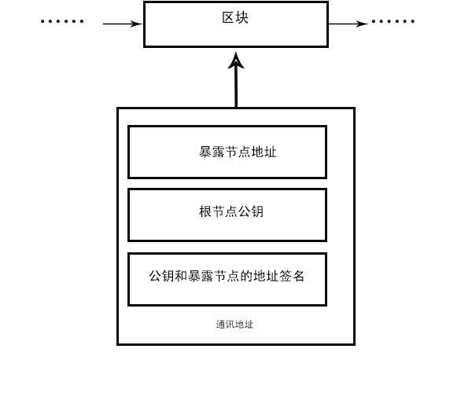
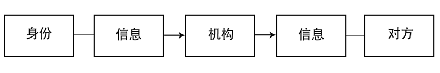
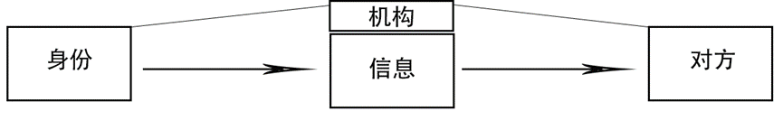
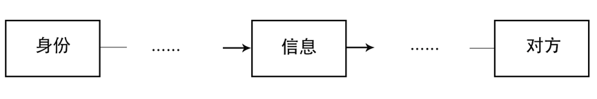

# 阿诺尔网:一种点对点匿名通讯系统

## AnoleNet: A peer-to-peer anonymous communication system

_author: btaskel bt_asker@hotmail.com_

摘要：匿名的通讯系统应不基于任何中心，也不能使用直接的双方地址进行通讯，而是应该双方都不知道对方的存在，在该基础上进行正常交流，这将保持双方不被监听到特征，也能够让彼此仍处于非信任的安全状态。P2P的公私钥通讯体系可以提供安全的保障，但是一旦泄露通讯双方这将让不怀好意的人所利用，另一方面基于中心化服务器的通讯需要人们无条件信任它，这也是该系统所不能接受的。该系统网络将某一通讯方的地址层层传递进多个需要中转的节点主机链中，并通过区块链[1]持久化该链的节点主机数据在所有的网络节点上，让网络上的所有主机可以根据主机标识来与该主机通讯，区块链及其激励措施也将保持节点离开此网络后节点主机链依旧可以正常运作。

关键字：节点链、节点散射、节点深度

### 1.简介

当今互联网通讯几乎都需要中转于一个第三方机构，或者是由第三方机构为P2P通讯搭接桥梁以此进行通讯。这样固有的信任模型都会产生一个问题：双方的地址都会泄漏。假设是第三方机构进行消息中转，如果该机构数据库泄漏在互联网中，那么 这个消息传输链也将泄露出去，没有加密或机构保存了数据交换所需的对称密钥，后果只会更加严重。第三方机构在不可信的情况下也会导致双方通讯被有意检查并中断或被拦截重要通讯消息。但目前为止以上问题可以直接使用P2P通讯解决。

单纯的P2P通讯仍然需要让双方地址在某一个机构中进行中转，这可以通过当今的公私钥体系安全地解决，但假设有一方使用代理进行通讯，这样做其中诚实一方或许会受到欺骗，使用代理服务器的一方又可能会因为代理不可信泄露了自己的真实身份而被另一方溯源，使用多个代理进行伪装虽然可以保护其中一方，但另一方无法确定该主机的身份因此仍有可能受骗，甚至可能是报复性打击。

现在需要一种能够保障双方都不知道对方真实身份情况下，不通过任何可信的第三方机构中转进行通讯的系统。通讯将通过多个节点进行中转，每个参与通讯的节点也会进行散射以此来加大追踪难度。这会保障通讯不会被托管到机构，也不会被任何一方溯源，甚至是通讯流量监控。在这篇论文中，我将提出一种基于区块链，使用节点通讯的深度和广度避免溯源通讯双方的一种方案。如果说某一方收到另一方消息后进行报复打击，因为在该系统中无法不通过主机链溯源任何一方，因此这种打击将不复存在。只要该网络中的节点被绝大多数诚实节点控制，那么它就是安全的。

### 2.广度与深度

我将每一个加入该网络的主机叫做节点，节点在加入后会获得权利与义务。权利是指，它有选择节点链与该网络中任何节点发起和接收匿名通讯的权利。义务是指，它必须成为网络每一个要通讯主机的主机链并承担深度、广度工作，深度即将于一个节点的通讯分散为大于等于2个节点进行通讯，广度即根节点与暴露在最外端需要多少个节点中转(本篇论文所有节点会使用深度和广度皆为2来举例)。履行义务的节点将会获得一定数量的奖励，以此保证网络可以正常运作。

### 3.节点通讯

现在仍有一个问题，怎么对上级节点进行地址隐匿与下级节点应怎么与上级节点通讯。在这里我将提出一种通过层层节点代理并散射的通讯方式——AnoleNet。首先要解决怎样与下级节点建立匿名连接。

在常规通讯中，一个主机想要找到目的通讯-主机需要该目的主机的地址。在该网络中，根节点(Node1)把自己的随机标识与实际地址转交给下级节点(N1-L1)，下级节点会保存该信息并使用根节点标识与节点地址，生成一个随机标识与根节点的地址形成映射关系，同时再将自身的地址与根节点形成的二级标识转交给下一个节点，由于在该示例中选定的深度为2，所以下级节点(N1-L2)是最终暴露外界的节点，在信息达到最终暴露节点后，该节点会向根节点通知暴露节点已经成功初始化，并由根节点赋予给暴露节点一个公钥作为加入该节点链的证据，对于其余节点根节点会使用现代公私钥交换技术进行隐瞒，这个证据会通过节点链到达暴露节点，暴露节点会将公钥、自身地址、公钥和暴露节点的地址签名广播出去，此时有新根节点想要建立主机连接该节点链，只需要根据对方的节点链发送的公钥哈希即可找到被连接方暴露节点所持有的某条节点链。

每一个节点都可以建立多个节点链，这些主机链在其组成的节点中都有时间戳，时间戳代表着该链的生命周期。

### 4.散射

该网络可以隐藏节点链的连接特征，能够防止追踪者溯源数据发送或接收者。我将提出一种链接散射机制，散射范围即本文提到的广度，假设有根节点想要建立节点链以此连接目标节点，它会从根节点开始按散射广度连接指定数量的二级节点，这些二级节点会根据深度判断是否再进行散射，当散射达到暴露节点后，该暴露节点假设没有实际参与进实际的节点链仍然会去随机链接网络上的任一节点，并且与该节点进行虚假的通讯，必须保持流量特征和网络绝大部分正常流量一致，如避免深度包检测。这种通讯没有实际价值，仅为迷惑追踪者保障双方不易被追踪。

### 5.激励

在该网络中为防止某一不可信节点的贪婪或无节制膨胀区块，网络会实行基于区块链的“AnoleCoin”奖励措施，它不会像其它去中心化币一样限制总发行量，相反它会随着时间逐渐增多，根据摩尔·戈登提出的摩尔定律与大卫·豪斯的结论，计算机晶体管会在每18个月提高一倍，规定总发行数量正违背这个规律，因此AnoleCoin应规定在多久后进行增量发行，这个值不应该大于世界平均带宽增长率或者违背摩尔定律。

每一节点想建立节点链等待某些节点的链接，这个节点必须向二级节点随时间支付一定比例的约定AnoleCoin，这样做可以防止根节点或二级节点的不诚实。二级节点会按约定扣除部分作为自己的奖励，并且将AnoleCoin随着散射给予其它节点作为中转数据的手续费，手续费仍然按时间进行比例交付，即便这些节点不承担实际的通讯工作，它们仍有资格得到。

### 6.区块信息

节点建立节点链后会把暴露节点的地址、公钥和暴露节点的地址签名、根节点公钥公布在区块中，当有另一个节点建立节点链链接时会使用目标根节点的公钥验证签名是否通过，并尝试连接暴露节点，如果成功则提供公钥哈希找到对应节点链。

当有另一节点链持有某节点链根节点公钥尝试寻找时，它会首先根据自己最新的区块逐渐往下寻找，直到找到与之匹配的暴露节点信息即可。

### 7.回收资源

正在运行的节点链其中有节点想要退出这个链，需首先向根节点发送退出链通知，之后尽力广播通知所有节点该节点的离开行为，随后即可在随机时间点退出。在退出链后，根节点假设想继续通讯，需要在网络中寻找空闲节点，并用其新建或组成完整的链。

假设暴露节点没有成功广播，或者根节点没有成功判断到一个节点的退出是否和自身所在链有关，还会形成一个混沌无效的信息残留在这个网络中，假设它长期留存在块中则将其移除。 

### 8.隐私

基于机构托管的传统信息交流，在最坏情况下，机构可以获取双方信息。

基于机构中转的p2p传统信息交流，在最坏情况下，机构能够得到双方身份。

基于AnoleNet的p2p的信息交流，在最坏情况下，机构只能获得通讯网络的敏感流量，无法轻易溯源双方。

参考文献
[1] Bitcoin: A Peer-to-Peer Electronic Cash System
